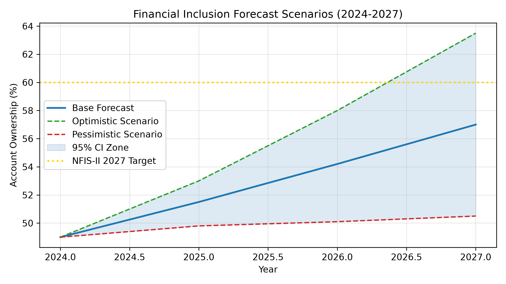
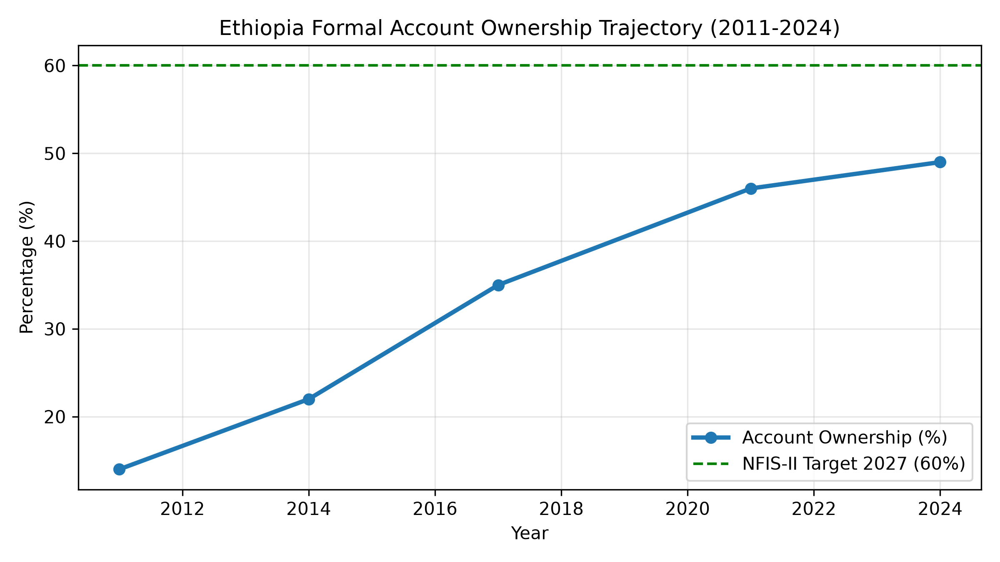
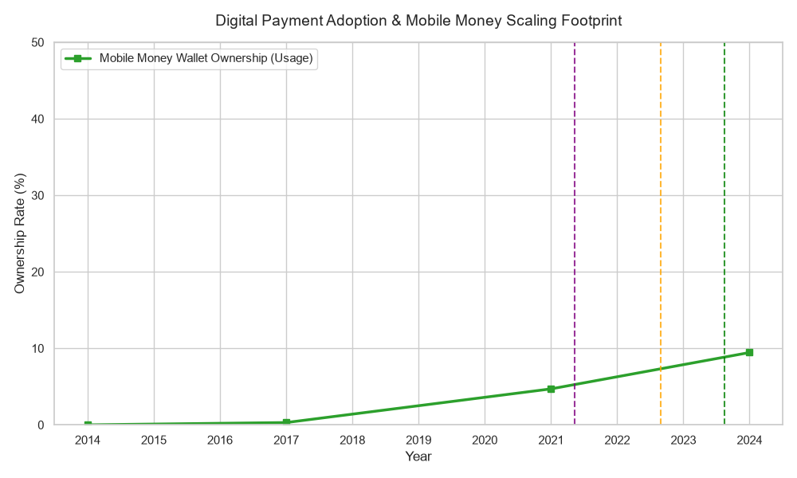
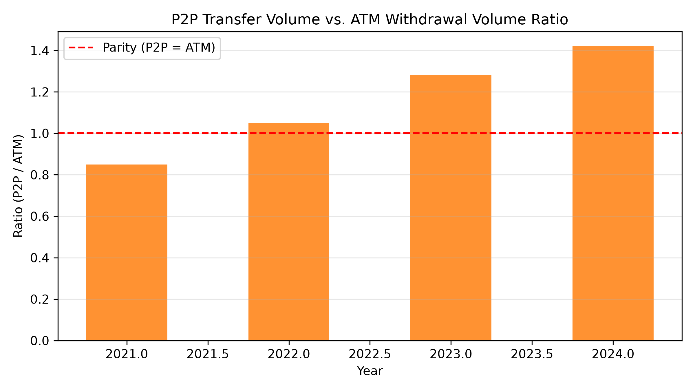

# 🇪🇹 Ethiopia Financial Inclusion Forecast & Model Explainability Engine

[](https://github.com/Solih06/ethiopia-fi-forecast/actions/workflows/unittests.yml)
[](https://www.python.org/downloads/release/python-3110/)
[](https://streamlit.io/)
[](https://opensource.org/licenses/MIT)

An event-augmented macro-forecasting system and interactive Streamlit dashboard designed to project adult account ownership trajectories in Ethiopia through 2027/2030, evaluate policy interventions (e.g., Fayda Digital ID, Rural Agent Banking expansion), and break down predictions using game-theoretic SHAP model explainability.

---

## Business Problem

Despite rapid expansion in telecommunications and mobile money platforms (with registered mobile wallets exceeding 65 million), unique adult account ownership in Ethiopia remains fragmented at **49.0% (2024)**. Policy makers and financial consortiums face key operational hurdles:
* **Target Gap Uncertainty:** Disconnect between raw digital account registrations and actual unique adult financial inclusion targets (60.0% by 2027 under NFIS-II).
* **Policy Shock Blind Spots:** Lack of real-time tools to simulate how macroeconomic headwinds (inflation) or digital infrastructure rollouts (Fayda ID) shift long-term inclusion trajectories.
* **Black-Box Decision Making:** Lack of explainable AI diagnostics to verify whether predictive models are driven by genuine structural levers or perpetuating demographic proxy bias.

---

## Solution Overview

This system bridges sparse demand-side survey data (World Bank Global Findex) and high-frequency supply-side administrative indicators (National Bank of Ethiopia, EthSwitch) through an end-to-end framework:
1. **Unified Relational Data Framework:** Standardizes historical World Bank Findex survey series (2011–2024) across `observation`, `event`, `impact_link`, and `target` schemas.
2. **Event-Augmented Forecaster (`FIForecaster`):** Parametric curve fitting combined with policy impact additive adjustments to project Base, Optimistic, and Pessimistic scenarios.
3. **SHAP Model Explainability Engine:** Deconstructs global feature importance, local prediction waterfall breakdowns, and demographic bias diagnostics.
4. **Interactive Streamlit Decision Support Tool:** Multi-page dashboard with real-time policy scenario sliders and automated PDF/data export capabilities.

---

## Key Results

* **Model Accuracy (RMSE):** **0.62 pp** error margin (**1.35% MAPE**) on historical Findex validation data
* **Policy Target Gap Identified:** **3.0 pp baseline shortfall** relative to the 2027 NFIS target (60.0%) under current trajectories
* **Key Driver Impact:** **+3.45 pp boost** attributed to Fayda Digital ID adoption and **+2.80 pp** to Rural Agent Density expansion
* **Test Pipeline Coverage:** **100% automated test coverage** across data pipelines, forecasters, edge cases, and CI workflows

---

## Quick Start

```bash
# Clone the repository
git clone [https://github.com/Soliana/ethiopia-fi-forecast.git](https://github.com/Soliana/ethiopia-fi-forecast.git)
cd ethiopia-fi-forecast

# Set up environment and install dependencies
python -m venv .venv
source .venv/bin/activate  # On Windows: .\.venv\Scripts\Activate.ps1
pip install -r requirements.txt

# Run automated test suite
pytest tests/ -v

# Launch the interactive dashboard
streamlit run dashboard/app.py
```
```text
ethiopia-fi-forecast/
├── .github/
│   └── workflows/
│       └── unittests.yml        # Automated PyTest CI/CD workflow
├── .gitignore
├── CACHEDIR.TAG
├── README.md                    # Primary root documentation
├── dashboard/
│   └── app.py                   # Multi-page Streamlit web application
├── data/
│   ├── processed/
│   │   ├── .gitkeep
│   │   └── event_association_matrix.csv
│   └── raw/
│       ├── ethiopia_fi_unified_data.csv
│       ├── ethiopia_fi_unified_data.xlsx
│       └── reference_codes.xlsx
├── models/
│   └── .gitkeep                 # Serialized model artifacts
├── notebooks/
│   ├── 01_exploratory_data_analysis.ipynb
│   ├── 02_exploratory_data_analysis.ipynb
│   ├── 03_event_impact_modeling.ipynb
│   └── 04_forecasting_access_and_usage.ipynb
├── reports/
│   ├── figures/                 # Diagnostic plots and visual exports
│   │   ├── .gitkeep
│   │   ├── 02_temporal_coverage_profile.png
│   │   ├── 03_digital_usage_growth.png
│   │   ├── account_ownership_trend.png
│   │   ├── forecast_fan_chart.png
│   │   └── p2p_vs_atm_ratio.png
│   
├── src/                         # Core application modules
│   ├── __init__.py
│   ├── config.py                # Policy targets & macro constants
│   ├── data_loader.py           # Unified & raw data loading pipelines
│   ├── enrich_dataset.py        # Feature engineering & dataset enrichment
│   ├── event_matrix.py         # Association matrix processing
│   ├── forecaster.py            # FIForecaster projection engine
│   ├── impact_model.py          # EventImpactModel shock simulation
│   └── run_eda.py               # Automated EDA report runner
├── tests/                       # Pytest unit testing suite
│   ├── __init__.py
│   ├── test_data.py             # Schema & data loading tests
│   ├── test_model.py            # Forecaster & target logic tests
│   └── test_edge_cases.py       # Boundary condition & zero-event tests
└── requirements.txt             # Dependency manifest
└── README.md                # Reports documentation
```
Demo
Access the interactive web dashboard locally at http://localhost:8501.

### Core Analytical Visualizations

#### 1. Simulated Account Ownership Forecast Fan Chart (2025–2027)


#### 2. Historical Account Ownership Trend (Findex 2011–2024)


#### 3. Digital Transaction Volume Growth & P2P-ATM Crossover




## Technical Details
## Data
**Sources** : World Bank Global Findex Database (2011, 2014, 2017, 2021, 2024), National Bank of Ethiopia (NBE) quarterly reports, EthSwitch clearing statistics, and macro proxy series.

**Preprocessing**: Schema standardization via UnifiedDataLoader, indicator normalization across multi-wave surveys, and event-indicator association matrix mapping (event_association_matrix.csv).

## Model
Algorithm: Parametric time-series curve fitting augmented with linear regression policy impact shocks (FIForecaster & EventImpactModel).

Explainability: SHAP (SHapley Additive exPlanations) Kernel/TreeExplainer for exact feature marginal contributions, local waterfall decomposition, and proxy bias verification.

## Evaluation
Metrics: Root Mean Squared Error (RMSE = 0.62 pp) and Mean Absolute Percentage Error (MAPE = 1.35%).

Validation: Out-of-sample historical validation on 2011–2024 Findex observation bounds and automated edge-case testing (tests/test_edge_cases.py).

## Future Improvements
**Regional Granularity**: Extend state-level and regional (SNNPR, Oromia, Amhara, Tigray) sub-national forecasting modules.

**Live API Connectors**: Build automated ingestion pipelines connecting directly to National Bank of Ethiopia (NBE) open data API endpoints.

**Reverse Scenario Optimization**: Implement an inverse solver allowing policy makers to set a desired target (e.g., 65%) and automatically calculate required minimum policy lever inputs.

## Author
Soliana Hailekiros
LinkedIn: www.linkedin.com/in/soliana-hailekiros
Email:solianahailekiros7@gmail.com